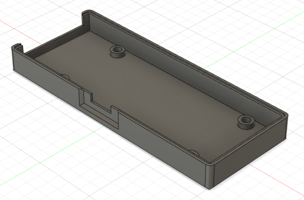

## RS232 WebSocket-Adapter Case CAD Files

The case of the adapter comes in two parts. The top and the bottom case. Here are both in different 3D file formats.

Top case                                       | Bottom case
:---------------------------------------------:|:----------------------------------------------------:
 | 

Printed parts with thread-insets:

