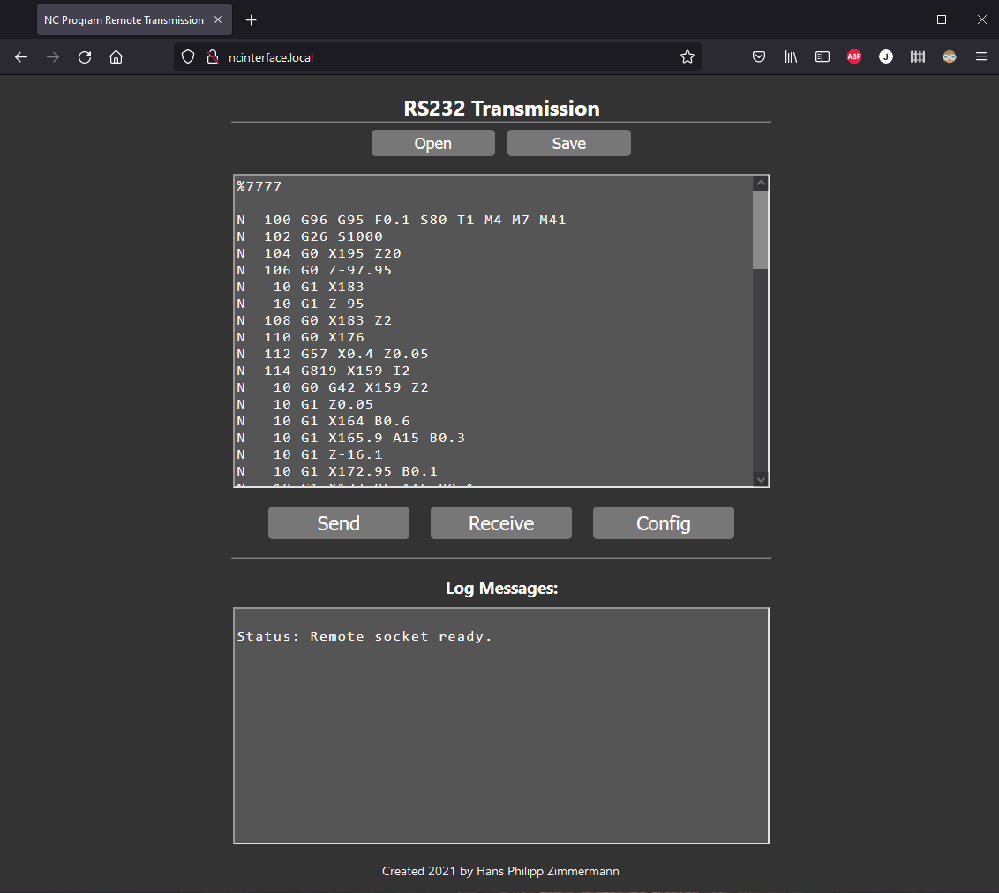
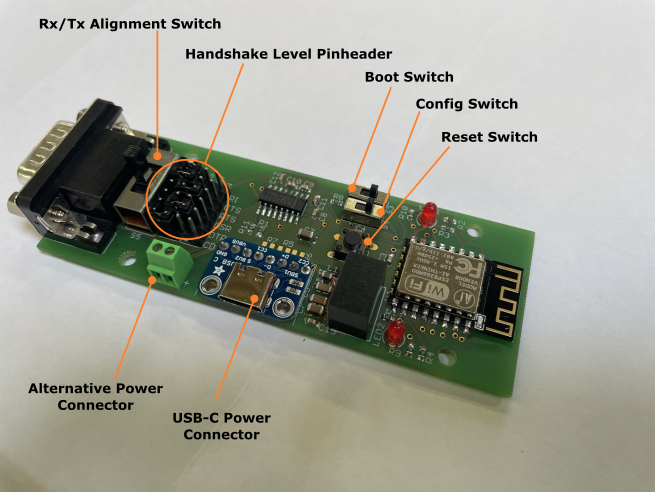

# RS232_Websocket_Adapter

This Project could be considered as the next-level development after my accomplishments with the apps for the serial data transmission to/from older EPL2 based machines. There were a few points which bothered me on my recent solutions: First thing is that the computer has to come to the machine, means there hast to be a (short) cable connection. What if I want to send data from the office? Second thing is the limitation to the windows platform. What if I want to use a mac or an android/ios-tablet or something. So this project does accomplish the following:
- Enable data exchange over RS232 interface (especially for EPL2 based machines)
- Exchange this data over a wireless connection in the local network
- Provides a platform independent front-end which can be access via browser

This repository provides all necessary data to build the WebSocket-Adapter.
- CAD data to create the [printed circuit board](CAD/Board)
- CAD data to create the [case](CAD/Case) for the adapter with a 3D printer
- The source code for the [backend/frontend](RS232WebSocketAdapter)

The front-end is accessible via browser from every device in the local network over the url "ncinterface.local".

### Special capabilities of the adapter
- The board contains a switch to select the RX/TX mode. The two lines can be crossed by this switch or used in line.
- The board also has pinheader bars. The level of these bars can be set directly out of the program and indiviually set for each of the hardware-handshake pins of the RS232 interface. This ensures the possibility to make the interface conform to every handshake needs of the machine.

**NOTE:** _In this picture the config-switch is in the **normal execution** position and the boot-switch is in **program mode** position_

### How it works

The adapter logs in to the local network and advertises its local domain *ncinterface.local* via MDNS. It acts as an webserver. By entering the url *ncinterface.local* the interface website is loaded and remains connected by a websocket. The interface consists of the transmission page and the config page. The RS232 connection parameter can be set using the config page.

### How to configure the network

To set up the network credentials the serial connection of the adapter must be used. Connect the adapter to a pc via USB to Serial adapter. Make sure all jumper of the handshake-pinheader bars are removed. Otherwise it will not work properly. The config switch of the adapter must be set to the appropriate position. Now connect the power-source and the device will start in config mode. To configure the network every serial terminal program can be used. I recommend to use my free app [*EPL Exchange*](https://epl-exchange.blogspot.com/). The parameters of the config interface are:
- Baudrate: 9600
- Parity: None
- Databits: 8
- Stopbits: 1
- Handshake: None

To set up the SSID (network name): type in "ssid", to set up the password for the network: type in "password" and follow the prompt respectively. Typing in "?" shows instructions to use. To check if the connection works, put the config switch in the *normal execution* position and press reset. While trying to connect the red led blicks. If the device is connected to the network the blue led is on.

### How to get it ready to use

In many modern scenarios the handshake is ignored, known as RS232 3-wire interface, but machines running EPL2 needs specific levels on specific hardware handshake pins during transmission and some other pins must be set to GND. The following configuration worked for all machines I have to do with:

| Pin Name | Configuration |
| -------- | ------------- |
| RI       | GND           |
| CTS      | GND           |
| RTS      | OUT           |
| DSR      | Not connected |
| DTR      | OUT           |
| CD       | GND           |

When the jumper bridges on the pinheaders are connected. Make sure the config-switch is in *normal execution* position and the boot-switch is in *program mode* position. Set the Rx/Tx switch in the appropriate position and connect the adapter with the machine. Plug the power source in. If all is correct configured, the adapter shows the blue led indicating the successful connection with the network.

TODO: picture of adapter plugged in!

Now every device in the local network is able to access the adapters interface by opening the url **ncinterface.local**

#### Note:
- There are some problems with browsers. I recommend firefox, this works on all platforms. The known problems are:
   - Microsoft Edge does not support opening *.local* urls. Instead a internet search is being performed. The solution here is to add the url as a bookmark. Clicking this bookmark opens the interface.
   - On iOS, Safari has problems with the websocket because the app using this interface must have permission granted to use the local network. Safari does not  seem to have this capability at all, so it won't work. Other browsers on iOS, like firefox, are working. By opening the interface a dialog to request the permission to use the local network is displayed. This must be positive confirmed.
- The interface configuration which can be done on the config page is only for the transmission mode (when sending data via WLAN), **NOT** for the configuration interface of the adapter. The configuration interface parameter are always the same (printed earlier in this readme).

### Resources
- Printed Circuit Board resources can be found [here](CAD/Board)
- CAD files for the case are located [here](CAD/Case)
- The source-code for controller is [here](RS232WebSocketAdapter)
- A website with further information on the [EPL2 data-transmission](https://epl2-datatransmission.blogspot.com/2020/08/epl2-datenubertragung.html)
- Infos about the application [EPL-Exchange](https://epl-exchange.blogspot.com/) which could be used to configure the adapter
